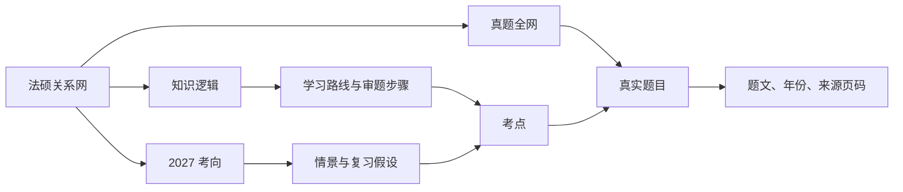
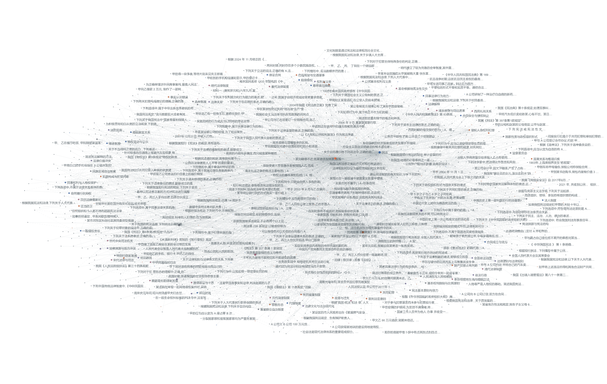
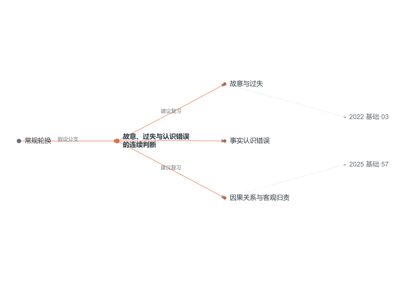
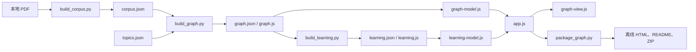

# 法硕关系网产品设计档案

本文件是项目的产品与设计依据。新对话先读 [快速交接](HANDOFF.md)，再按修改范围阅读本档案。当前用户的新要求优先；产品决策改变后，应同步更新这里，避免不同窗口沿用不同版本。

## 1. 档案状态与依据

| 项目 | 当前状态 |
| --- | --- |
| 整理日期 | 2026-10-07 |
| 产品名称 | 法硕关系网 |
| 代码基线 | `a15b4bd`；整理开始时本地与远程 `main` 一致，工作区干净 |
| 在线产品 | [GitHub Pages](https://johnson-durui.github.io/law-exam-atlas/) |
| 代码仓库 | [Johnson-Durui/law-exam-atlas](https://github.com/Johnson-Durui/law-exam-atlas) |
| 实现形态 | 原生 HTML / CSS / JavaScript，静态数据，可生成离线单文件 |
| 设计依据 | 当前代码、数据、生成脚本、既有验证记录，以及用户已确认的要求 |

本档案覆盖旧版 `LEARNING_DESIGN.md`、`WORKBENCH_DESIGN.md` 的现行规则；旧文档改为索引，历史方案可从 Git 查看。README 面向使用者，HANDOFF 面向修改和交接，NOTICE 说明材料与来源边界。

## 2. 定位、用户与目标

让零基础备考者从一题找到知识点，再沿学习顺序理解关联，并把历史真题线索用于安排 2027 年复习。关系网也用于宣传分享，因此需要远看有整体结构、近看能读懂、点击能继续追问。

| 使用目的 | 产品提供的帮助 | 完成标志 |
| --- | --- | --- |
| 零基础学习 | 五科审题路线、步骤提示、对应考点 | 能说明下一步先判断什么 |
| 真题复习 | 搜索筛选、题目详情、候选考点和来源页码 | 能回到题文核对关联 |
| 考向复习 | 2027 分支、推测依据、不确定性、练习与自查点 | 能把一个分支转成复习任务 |
| 展示分享 | 全窗口图谱、指定分支链接、SVG 导出、README 示意图 | 他人能打开并继续交互 |

当前没有账号、云端学习记录、支付、在线问答、自动批改或完整答案库。早期提出的“逐年盲测预测、揭晓、纠正”尚未形成可复现的回测流程，不能宣称已验证命中率。

## 3. 已确认的产品与品牌约束

- 界面不使用绿色。白底、黑灰文字、蓝色导航和橙色考向为主，不用发光球、渐变大背景、无信息的装饰卡片。
- 参考 MiroFish 的密集关系感，但每条关系必须有含义；点击后能看到上下文、来源或学习理由。
- 对外名称不强调“（非法学）”。保留真实材料文件名，不据此宣称覆盖所有考试类别。
- 真题、学习建议、预测假设、原创练习明确区分。预测不能伪装成历年真题、确定结论或概率。
- 保留可点击的 2027 考向分支，并照顾零基础使用者，文案尽量是具体问题和操作。
- README 放真实关系网示意图，并链接到在线交互页面。
- 用户已同意公开提取题文和图谱数据。公开范围不包括整个桌面、原卷 PDF、教材文件夹或账号凭据。

## 4. 信息架构与页面结构

内容入口和展示方式是两套独立状态，修改时不要混成一个开关。

| 内容入口 `layer` | 用户看到什么 | 数据来源 |
| --- | --- | --- |
| `exams` 真题全网 | 真题、年份、科目、题型、候选考点及学习联系 | `graph.js` |
| `learning` 知识逻辑 | 五科学习路线 → 审题步骤 → 考点 → 真题 | `learning.js` + 基础图 |
| `forecast` 2027 考向 | 情景 → 考向 → 考点 → 历史题线索 | `learning.js` + 基础图 |

| 展示方式 `mode` | 布局与行为 |
| --- | --- |
| `graph` 关系网 | 图谱占满窗口，悬浮工具与详情；首页默认模式 |
| `split` 工作台 | 目录、图谱、详情三部分，窄屏重新排布 |
| `list` 题库 | 题目列表；进入时切到真题内容 |

`index.html` 默认展示 **2027 考向 + 关系网**。全窗口布局不等于浏览器原生全屏，原生全屏由按钮调用。打包的工作台版默认使用 `split`。

下图来自现有项目，供理解视觉方向；它们是静态示意，功能以代码为准。

## 5. 核心交互与状态

### 考向探索

1. 在考向全览中选择科目、情景，或直接点击考向节点。
2. 展开该分支，沿情景、考向、知识点、历史题线索阅读。
3. 详情显示推测理由、不确定性、复习步骤、原创练习和自查要点。
4. 点击相关真题核对题文与来源；返回全览继续探索。
5. 地址带有分支 hash，例如 `#forecast-cr-01`，可复制分享。

三种情景 ID 为 `rotation`、`revisit`、`transfer`，显示为常规轮换、补充覆盖、情境迁移。情景是复习假设，不是已验证的预测模型。

现有实现启动时读取 hash，`openStudy()` 打开考向或学习路线时更新地址；没有完整的 `hashchange` 路由和浏览器前进后退状态系统。修改分享导航时必须单独验证。

### 学习与真题

学习全览每条路线先显示前三步；进入路线后展开全部步骤。真题支持文本、年份、科目、题型及关系筛选；目录每页 40 项，题库先显示 80 项，再逐批加载。选中节点或边后显示详情与关联。

| 状态 | 预期行为 |
| --- | --- |
| 无筛选结果 | 显示空结果，不回退成全部题目 |
| 选中分支 | 展开相关子图；详情可关闭，其他必要上下文仍可见 |
| 提取待核对 | 保留状态标记，不当作逐字审核后的完整真题 |
| 原卷链接 | 本地目录可关联原 PDF；在线版显示文件名、页码及原卷不可用信息 |
| 全屏调用失败 | 使用全窗口布局，不让核心操作失效 |
| 数据或模型异常 | 保留现有校验与错误提示，不静默填造题目 |

搜索输入使用约 180 ms 防抖，浮动搜索与目录搜索同步。图谱支持拖拽、缩放、节点/边选择、适配视野、标签开关及 SVG 导出。

## 6. 数据事实与解释边界

以下为 2026-10-07 对仓库现有数据的统计，是快照，不是永远固定的产品指标。

| 数据项 | 数量或范围 |
| --- | --- |
| 真题 / 考点 | 1,579 / 80 |
| 基础图节点 / 关系 | 1,692 / 6,025 |
| 自动提取 / 提取待核对 | 1,035 / 544 |
| 关键词候选关系 | 1,217 条，涉及 753 道题 |
| 考点学习联系 | 71 条：学习关联 39、历史比较 22、区别 10 |
| 材料来源记录 | 38 条，其中 31 条提取到题目 |
| 五科学习路线 | 5 条，共 27 步 |
| 2027 考向 | 20 个，五科各 4 个，分属 3 种情景 |
| 考向引用线索 | 57 条引用记录，不等于 57 道去重真题 |

材料年份为 2005—2026，覆盖不完整。2020 两卷、2021 综合、2024 两卷没有可靠完整题面；部分旧卷也有缺题。2024 的答案材料不能冒充完整题面。自动提取也不代表已经逐字核对。

| 关系方法 | 表达的事实 | 不能由此推出 |
| --- | --- | --- |
| `metadata` | 题目的年份、科目、题型 | 自动归类绝对准确 |
| `keyword` | 题干或选项命中了考点词语 | 正确答案、确定考点、命题概率 |
| `concept` | 编写的学习联系、历史比较或区别 | 两条规则可以相互替代 |
| 学习/预测层关系 | 建议的思考顺序、复习假设与线索 | 历史真题事实或因果证明 |

当前考向引用从 2022、2023、2025、2026 的自动提取题中，按候选关键词联系选取，每个分支最多 3 条。没有 2027 真题节点。上年考过可以影响复习假设，但不能成为自动排除整个章节的规则。历史题需结合当年的法律背景，图谱本身不提供完整现行法校验。

## 7. 视觉规范

以紧凑的知识工作台为基调：白底、细灰线、克制的颜色与阴影，信息密度来自真实内容。标题、工具、图谱和详情各有层次，不用大段口号占据画布。

| 用途 | 当前颜色 |
| --- | --- |
| 页面背景 / 主文字 / 次文字 | `#f7f7f8` / `#24262b` / `#757780` |
| 边线 / 强边线 | `#e5e5e8` / `#d5d6db` |
| 主强调 / 浅强调背景 | `#345c99` / `#eff2f8` |
| 刑法 / 民法 | `#bb633d` / `#345c99` |
| 法理学 / 宪法学 / 法制史 | `#6c658e` / `#747780` / `#9a6479` |
| 考向节点 / 步骤节点 | `#e56f3f` / `#1d4f78` |
| 考向根节点 / 情景节点 | `#182f44` / `#69717a` |

中文使用系统字体及 Microsoft YaHei 回退；少量编号与辅助标记使用等宽字体。圆角克制，边框为主要分隔。**没有绿色选中态**，旧方案中的绿色规则已失效。

`style.css` 存在历史样式与后置覆盖，修改前查看最终生效规则。Canvas/SVG 配色在 `graph-view.js`，HTML 图例在 `index.html`；只改 CSS 不会同步整个图谱。

逻辑图采用分层位置与多行文字，当前屏幕字号约 13.5 px。标签宽度随视口调整；选中分支可以获得更宽的阅读区域。Canvas、SVG、适配视野和命中区域共用文字测量逻辑，修改时应一起验证。低优先级重叠标签可以隐藏，选中标签优先显示；关系标签避免压住节点。

密集真题图保留小点和局部标签，缩放后逐步阅读。题目标签可截取题文前段，提取异常时回退为题号或待核对提示。不能为了“串联万物”的视觉效果添加没有含义的连线。

## 8. 响应式、可访问性与动效

- 宽屏打开详情时为图谱留出侧栏空间；当前 1,000 px 以上采用约 445 px 的详情占位，具体布局以 `style.css` 最终生效规则为准。
- 850 px 以下工具换行，420 px 以下进一步压缩筛选控件；工作台在 760 px 以下改为纵向。
- 小屏允许平移查看局部，优先保证节点可读、详情可打开，而非强行把全部文字缩成一屏。
- 聚焦图谱后支持方向键、`+/-`、`Home`、`N / Shift+N`、`E`。Canvas 外的目录与题库提供文本入口，按钮保持可聚焦与明确名称。
- 不增加无目的的自动动画；交互反馈用于帮助用户定位和理解。

既有渲染验证覆盖大画布、常见宽屏与 390 px 窄屏布局，但主要使用 DOM/Canvas 替身，不等于完整浏览器、触屏或无障碍审计。后续新增交互要按实际设备补查。

## 9. 文案与内容规范

优先写“先判断主体”“查看原题”“返回全览”等具体行动。预测说明写清依据和可能变化，不使用“必考”“精准命中”“全覆盖”等未经验证的措辞。

题目详情保留真实年份、题号、来源页码和提取状态。关键词关联称为“候选考点”或“词语线索”；原创练习明确标注，不能计入真题数量。对外不强调考试类别括注，但真实来源标识仍可出现原文件名称。

## 10. 技术结构与数据接口

项目没有 npm 构建、后端、数据库、登录或外部 CDN。浏览器直接加载脚本全局对象，数据同时保留 JSON 与 JS 两种形式，避免离线页面依赖 `fetch`。

| 接口或文件 | 责任与关键字段 |
| --- | --- |
| 基础节点 | `uuid`, `name`, `labels`, `summary`, `attributes`；类型为 Question、Topic、Year、Subject、Type |
| 基础关系 | `source_node_uuid`, `target_node_uuid`, `name`, `fact_type`, `fact`；`attributes.method` 说明关联方法 |
| Question 属性 | 年份、卷别、题号、科目与归类方式、题型、题文、源文件、页码、提取状态、考点 ID |
| `learning.json` | `meta`, `scenarios`, `predictions`, `pathways`；考向有理由、不确定性、步骤、练习和证据引用 |
| `LawGraphModel` | 校验、节点索引、筛选、邻居与相关题查询 |
| `LawLearningModel` | 按科目、情景、搜索、焦点生成学习或考向子图，返回 `layout: 'logic'` |
| `LawGraphView` | Canvas 绘图、命中、缩放、选择、适配、标签和 SVG 导出 |
| `app.js` | 页面状态、筛选同步、目录/详情、模式切换、hash、下载和全屏 |

考点原始 ID（如 `cr01`）与图节点 ID（如 `topic-cr01`）不同，考向的 `topicIds` 使用原始 ID。法制史名称有归一化处理。学习层的 Forecast、Scenario、Prediction、Pathway、Step 是运行时构建的节点，不应计入基础图的真题数量。

## 11. 修改入口与生成规则

| 要修改什么 | 首选文件 | 连带检查 |
| --- | --- | --- |
| 页面入口、工具栏、图例 | `index.html`、`style.css`、`app.js` | 页面测试、窄屏、键盘操作 |
| 节点外观、文字、连线、导出 | `graph-view.js` | 相关渲染测试、SVG、点击区域 |
| 筛选、邻居查询 | `graph-model.js` | `test_model.cjs` |
| 学习和考向的结构、布局 | `learning-model.js` | 学习模型、逻辑图与页面测试 |
| 学习步骤、考向理由和练习 | `build_learning.py` | 重新生成 learning，再检查模型与布局 |
| 考点词表与候选关联 | `data/topics.json`、`build_graph.py` | 重新生成 graph，再生成 learning |
| 原卷提取问题 | `build_corpus.py` 与原 PDF | corpus → graph → learning；核对原页 |
| README / 离线包 | `package_graph.py` | README 会被重写；检查离线产物 |
| 产品规则与交接 | `DESIGN.md`、`HANDOFF.md` | 保持索引、实际实现与记录一致 |

重要的覆盖关系：

- **不要只改生成数据。** 考向正文源头在 `build_learning.py`；图数据源头在提取结果、考点词表和构建逻辑。
- **不要只改 README。** `package_graph.py` 内有完整 README 模板，打包会覆盖手写修改。
- 打包会更新入口的资源指纹，生成三个单文件 HTML、README、ZIP；存在渲染快照时还会生成分享图 SVG。
- 渲染测试写入 `snapshots/`，不会自动替换 `assets/` 的两张公开 PNG 示意图。
- `20` 个分支、`2027` 等值存在于内容、断言、页面或模型中。增减分支、跨年升级时一起查找，不能只改显示标题。
- 公开仓库包含可运行的 graph / learning 数据，但不包含原 PDF 和被忽略的 corpus，因此新克隆可以运行，不能凭空重做原卷提取。

## 12. 验证、发布与证据

具体命令见 [HANDOFF.md](HANDOFF.md)。根据修改范围选择最小充分验证；文档修改不需要重跑全部图谱渲染。

模型测试检查数据与查询，页面/渲染测试使用最小 DOM/Canvas 替身。SVG/PNG 检查用于确认可读性，不应称作真实浏览器端到端测试。新交互或发布后的运行情况，仍需在允许的浏览器环境中验证。

本地 `verification.json` 是 2026-09-24 的历史记录，不能替代当前修改的验证。2026-10-07 整理前核对了远程 `main` 和 Pages：对应代码基线，Pages 状态为 built。

GitHub Pages 从 `main` 根目录部署，使用 `.nojekyll`，仓库没有自定义发布 workflow。推送完成和页面更新是两个状态；需要发布时核对具体提交与 Pages 构建。提交前查看 diff，只包含任务相关文件，保持原 PDF、凭据和个人路径不进入公开数据。

## 13. 已知限制与后续候选

| 项目 | 当前事实 / 后续方向 |
| --- | --- |
| 材料质量 | 544 道待核对，部分年份缺题；优先补证据与校对，不补造题文 |
| 预测可信度 | 目前是复习假设；若做逐年回测，应保存预测时可见数据、规则和揭晓结果 |
| 小屏与无障碍 | 有适配和键盘入口；仍可补充真机与辅助技术验证 |
| 分享导航 | 支持初始 hash 深链；完整浏览器历史导航尚未实现 |
| 后续规模 | 当前为静态图；新增大量材料后再实测性能，不提前引入后端 |
| 个人学习功能 | 收藏、笔记、进度、答案库是候选，未经本轮要求，不视为待交付功能 |

这次档案整理不改变产品功能、题库或考向内容。后续对话根据新任务确定范围，完成后更新交接记录；不要把本节候选事项自动变成必须实施的任务。
