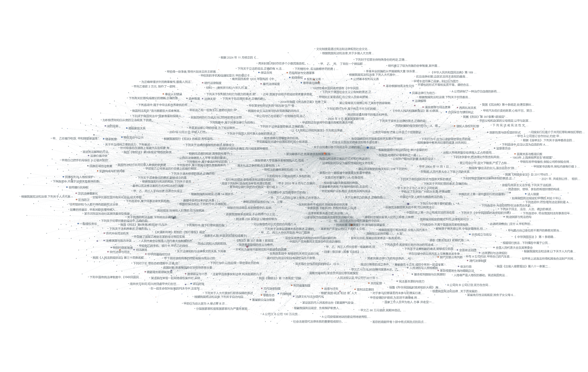
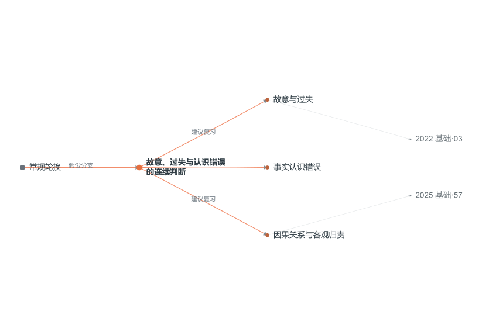

# 法硕关系网

[打开在线关系网](https://johnson-durui.github.io/law-exam-atlas/) · [GitHub 仓库](https://github.com/Johnson-Durui/law-exam-atlas)

一个可离线运行的法硕真题与知识网络。白底、黑灰文字、蓝色导航与橙色预测分支，无外部依赖。

真题关系网示意图。点击图片进入交互版，可缩放、筛选并查看节点详情。

## 三个入口

- **真题全网**：1,579 道已提取真题、80 个考点。按年份、科目、题型、题文筛选，点节点与连线追踪候选关联。
- **知识逻辑**：五科审题路线。点击科目展开“先问什么、再查什么、如何组织结论”，继续连接具体考点与真题。
- **2027 考向**：20 个复习分支，分为常规轮换、补充覆盖、情境迁移。点分支直接展开子图、复习步骤、原创练习、自查要点与历史题词语线索。

考向分支示意图：从复习假设展开知识点和真题线索。预测与真题分开展示。

打开即进入全窗口的 2027 考向图。滚轮缩放、拖拽平移、点击文字或节点看详情；“返回全览”回到上一级。“工作台”显示目录和详情，“全屏”调用浏览器全屏，“导出”保存当前 SVG。键盘聚焦图谱后可用方向键、+/-、Home、N / Shift+N 和 E。

分支支持 hash 链接，例如 `#forecast-cr-01`；复制当前地址即可分享指定考向。手机也可以选择分支、查看详情和切换内容入口。

## 运行与数据

直接打开 `index.html`；也可用单文件版 `法硕真题关系网_全屏版.html` 或 `法硕真题关系网_工作台版.html`。公开仓库以根目录部署到 GitHub Pages，不需要服务端、账号或 API 密钥。

- `data/graph.json` / `graph.js`：历年真题和候选知识联系。
- `data/topics.json`：考点词表。
- `data/learning.json` / `learning.js`：2027 备考假设与五科学习路线。
- `build_learning.py`：根据已存在的图谱 ID 生成考向与来源线索。
- `build_corpus.py` / `build_graph.py`：本地原卷提取与基础图构建，需自行保留原 PDF 和 corpus 数据，提取依赖 pypdf。
- `package_graph.py`：生成内嵌数据的离线 HTML 和 ZIP。

## 内容边界

2005—2026 的材料覆盖不完整：2020 两卷、2021 综合、2024 两卷没有可靠完整题面；其他部分旧卷也有缺题。1,035 道标为自动提取，544 道提取待核对。自动提取不等于逐字校对。

候选关联由题干和选项关键词形成，可能命中错误选项。连线不能当作答案或确定考点。学习箭头表示建议的思考顺序；跨科和历史联系不表示规则可以相互替代。

2027 分支是复习假设，没有命题概率或经验证的命中率。“上年考过的章节下年不考”不是本项目的排除规则。原创练习独立标注，不计入真题数量。历史试题应按当年法律背景理解。

网页未附原卷 PDF，显示文件名和页码；本地版在原目录可打开原卷。没有发布用户整个桌面或教材文件夹。材料权利说明见 `NOTICE.md`。

## 验证

用 Node 运行 `test_model.cjs`、`test_learning_model.cjs`、`test_renderer.cjs`、`test_dense_renderer.cjs`、`test_logic_renderer.cjs`、`test_learning_renderer.cjs`、`test_app.cjs`。

模型测试检查 ID、关系端点和筛选；页面与渲染测试使用最小 DOM/Canvas 替身。实际数据导出的 SVG/PNG 用于布局检查，这些不是浏览器端到端截图。发布后另核对 GitHub Pages 构建状态和线上静态资源，并在公开页面检查入口切换、点击考向展开详情等交互。
